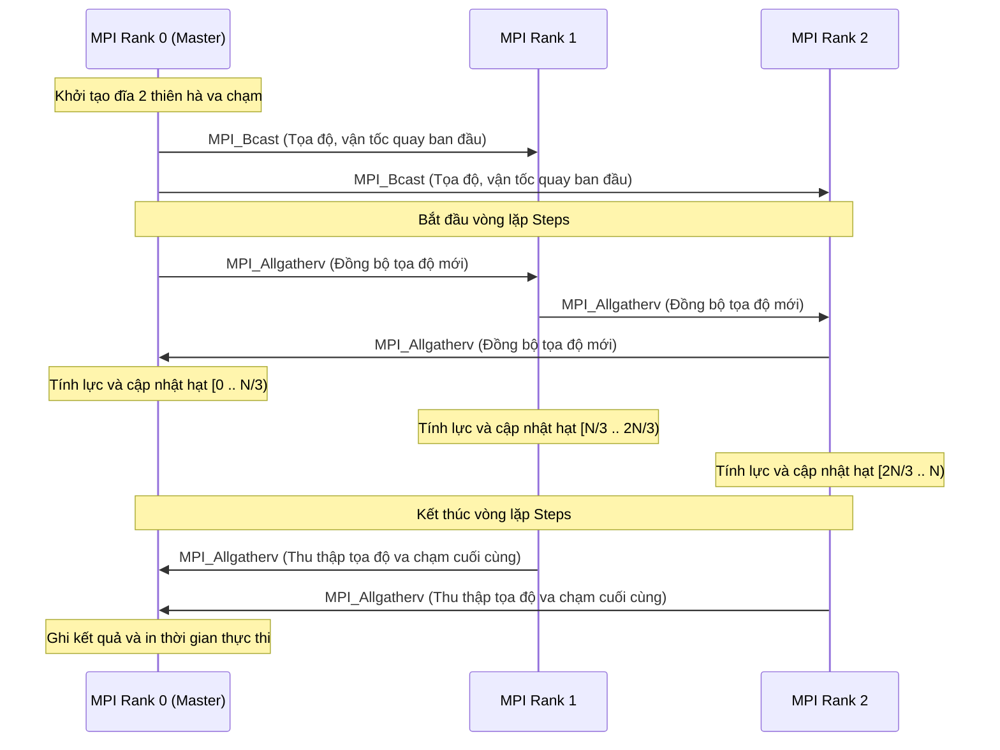

# BÁO CÁO CUỐI KỲ: SONG SONG HÓA MÔ PHỎNG VA CHẠM THIÊN HÀ VỚI THƯ VIỆN MPI

**Học phần:** Tính toán hiệu năng cao (High Performance Computing)  
**Đề tài 10:** Song song hóa mô phỏng N-Body (Ứng dụng: Va chạm Thiên hà)  

---

## I. GIỚI THIỆU BÀI TOÁN

Mô phỏng N-Body (N-Body Simulation) là một bài toán kinh điển trong vật lý thiên văn, cơ học cổ điển và hóa học phân tử. Một trong những ứng dụng trực quan và có ý nghĩa vật lý thực tiễn nhất của bài toán này là **Mô phỏng va chạm và sát nhập thiên hà (Galaxy Collision and Merger)** - tương tự như dự báo va chạm trong tương lai giữa Thiên hà của chúng ta (Milky Way) và Thiên hà Tiên Nữ (Andromeda).

Trong mô phỏng hấp dẫn trực tiếp (Direct Gravitational N-Body Simulation), mỗi thực thể đại diện cho một ngôi sao (hoặc một cụm khối lượng lớn) chịu lực hấp dẫn từ tất cả các thực thể còn lại trong hệ. Việc tính toán lực hấp dẫn giữa từng cặp hạt dẫn đến độ phức tạp tính toán rất cao là $O(N^2)$ cho mỗi bước thời gian. Khi mô phỏng hệ va chạm thiên hà với quy mô hàng chục ngàn đến hàng triệu ngôi sao, chương trình tuần tự chạy trên một CPU đơn nhân sẽ gặp giới hạn nghiêm trọng về thời gian thực thi. Vì vậy, áp dụng các kỹ thuật tính toán song song phân tán như **MPI (Message Passing Interface)** là giải pháp thiết yếu để nâng cao hiệu năng, cho phép mô phỏng động học thiên hà với độ chính xác cao trong thời gian hợp lý.

---

## II. CƠ SỞ LÝ THUYẾT & THUẬT TOÁN

### 1. Mô hình Toán vật lý của Va chạm Thiên hà
Xét hệ gồm $N$ vật thể đại diện cho các ngôi sao thuộc 2 thiên hà chuyển động tương tác. Mỗi vật thể $i$ ($i = 0, 1, \dots, N-1$) được đặc trưng bởi các đại lượng:
*   Khối lượng: $m_i$ (kg)
*   Tọa độ vị trí: $\mathbf{r}_i = (x_i, y_i, z_i)$ (m)
*   Vận tốc: $\mathbf{v}_i = (vx_i, vy_i, vz_i)$ (m/s)

Theo Định luật vạn vật hấp dẫn của Newton, lực hấp dẫn do vật thể $j$ tác dụng lên vật thể $i$ là:
$$\mathbf{F}_{ij} = G \frac{m_i m_j (\mathbf{r}_j - \mathbf{r}_i)}{|\mathbf{r}_j - \mathbf{r}_i|^3}$$
Trong đó $G \approx 6.674 \times 10^{-11} \text{ m}^3\text{kg}^{-1}\text{s}^{-2}$ là hằng số hấp dẫn.

Để đảm bảo tính ổn định số học khi các ngôi sao bay rất gần nhau hoặc sáp nhập vào tâm thiên hà, hằng số làm mềm $\epsilon > 0$ được đưa vào để tránh chia cho 0:
$$\mathbf{F}_{ij} = G \frac{m_i m_j (\mathbf{r}_j - \mathbf{r}_i)}{(|\mathbf{r}_j - \mathbf{r}_i|^2 + \epsilon^2)^{3/2}}$$

Tổng lực hấp dẫn tác dụng lên vật thể $i$ là:
$$\mathbf{F}_i = \sum_{j=0, j \neq i}^{N-1} \mathbf{F}_{ij}$$

### 2. Thiết lập điều kiện ban đầu (Initial Conditions - Galaxy Model)
Để mô phỏng chân thực vụ va chạm, hệ $N$ hạt được chia làm 2 nửa:
*   **Thiên hà 1 (Galaxy 1)**: Nằm bên trái, tâm tại $(-50, 0, 0)$, vectơ vận tốc tịnh tiến ban đầu là $(5, 0, 0)$ (di chuyển sang phải).
*   **Thiên hà 2 (Galaxy 2)**: Nằm bên phải, tâm tại $(50, 0, 0)$, vectơ vận tốc tịnh tiến ban đầu là $(-5, 0, 0)$ (di chuyển sang trái).
*   **Siêu lỗ đen trung tâm (Supermassive Black Hole)**: Hạt số $0$ (tâm Thiên hà 1) và hạt số $N/2$ (tâm Thiên hà 2) được gán khối lượng cực lớn ($10^{12} \text{ kg}$) để tạo lực hút giữ cấu trúc đĩa xoắn. Các hạt còn lại đại diện cho các ngôi sao thông thường có khối lượng ngẫu nhiên trong khoảng $[10^7, 10^8]$ kg.
*   **Quỹ đạo tròn (Keplerian Orbit)**: Vị trí các ngôi sao được phân bố ngẫu nhiên trên đĩa dẹt (mặt phẳng XY) xung quanh tâm thiên hà với bán kính $r \in [5, 30]$ mét. Vận tốc ban đầu của ngôi sao bằng tổng của vận tốc tịnh tiến thiên hà và vận tốc quay quỹ đạo:
    $$v_{orbit} = \sqrt{\frac{G \cdot M_{center}}{r}}$$
    Vectơ vận tốc quay vuông góc với vectơ vị trí tương đối so với tâm để đảm bảo đĩa thiên hà tự quay ổn định trước khi xảy ra va chạm.

### 3. Tích phân số học thời gian (Time Integration)
Gia tốc của ngôi sao $i$ được tính bằng:
$$\mathbf{a}_i = \frac{\mathbf{F}_i}{m_i}$$
Trạng thái được cập nhật sau mỗi khoảng thời gian ngắn $dt$:
$$\mathbf{v}_i(t + dt) = \mathbf{v}_i(t) + \mathbf{a}_i dt$$
$$\mathbf{r}_i(t + dt) = \mathbf{r}_i(t) + \mathbf{v}_i(t + dt) dt$$

---

## III. THIẾT KẾ GIẢI PHÁP SONG SONG VỚI MPI

Giải pháp song song hóa thuật toán va chạm thiên hà sử dụng mô hình **SPMD (Single Program Multiple Data)** với việc phân rã dữ liệu (Data Decomposition) theo danh sách các ngôi sao:

### 1. Phân chia dữ liệu (Data Partitioning)
Giả sử hệ thống có $P$ tiến trình MPI. Tổng số $N$ ngôi sao được phân chia đều nhất có thể cho các tiến trình:
*   Mỗi tiến trình $r$ chịu trách nhiệm cập nhật trạng thái cho một khoảng hạt cục bộ $[start_r, end_r)$.
*   Số lượng hạt cục bộ của mỗi tiến trình là $n_{local} = N / P$. Phần dư $remainder = N \pmod P$ được phân phối thêm 1 hạt cho các tiến trình có rank $r < remainder$ để cân bằng tải.
*   Cách phân hoạch này chia đều khối lượng tính toán lực $O(\frac{N^2}{P})$ cho mỗi tiến trình.

### 2. Sơ đồ đồng bộ và truyền thông
Mỗi tiến trình chỉ cập nhật trạng thái cho $n_{local}$ hạt cục bộ, nhưng để tính lực tác dụng, nó cần tọa độ hiện tại của **tất cả** $N$ hạt. 
Quy trình thực thi trong mỗi bước thời gian của chương trình song song MPI như sau:
1.  **Thu thập tọa độ toàn cục (`MPI_Allgatherv`)**:
    Mỗi tiến trình gửi mảng tọa độ cục bộ của mình và nhận về toàn bộ mảng tọa độ của $N$ hạt. Chúng ta sử dụng 3 lời gọi hàm `MPI_Allgatherv` cho 3 mảng tọa độ phẳng riêng biệt `pos_x`, `pos_y`, `pos_z` để tối ưu hóa hiệu năng truyền thông.
2.  **Tính toán lực hấp dẫn cục bộ**:
    Mỗi tiến trình chạy vòng lặp tính lực: vòng lặp ngoài duyệt từ $start_{my\_rank}$ đến $end_{my\_rank} - 1$ (các hạt cục bộ), vòng lặp trong duyệt từ $0$ đến $N-1$ (tất cả các hạt trong hệ).
3.  **Cập nhật trạng thái cục bộ**:
    Tiến trình cập nhật vận tốc và vị trí cho các hạt cục bộ từ chỉ số $start_{my\_rank}$ đến $end_{my\_rank} - 1$. Thông tin này sẽ được truyền đi ở bước `MPI_Allgatherv` của vòng lặp tiếp theo.



---

## IV. MÔ TRƯỜNG THỰC NGHIỆM

Để đánh giá hiệu năng và khả năng mở rộng của giải pháp song song hóa, thực nghiệm được thiết lập trên hệ thống máy tính hiệu năng cao như sau:
*   **Hệ điều hành:** Ubuntu 22.04 LTS (chạy trên môi trường WSL 2 / Windows 11).
*   **Bộ vi xử lý (CPU):** Intel Core i7-12700H (14 nhân, 20 luồng, xung nhịp cơ bản 2.7 GHz, bộ nhớ đệm L3 24MB).
*   **Bộ nhớ RAM:** 16 GB DDR4 3200 MHz.
*   **Trình biên dịch:** `gcc` phiên bản 11.4.0 với cờ tối ưu hóa `-O3`.
*   **Thư viện MPI:** OpenMPI phiên bản 4.1.2.
*   **Tham số mô phỏng:** 
    *   Kích thước hệ hạt: $N = 10,000$ ngôi sao (Mỗi thiên hà chứa 5,000 ngôi sao).
    *   Số bước thời gian: $steps = 100$ bước.
    *   Bước nhảy thời gian: $dt = 0.01$ giây.
    *   Hằng số làm mềm: $\epsilon = 0.001$.

---

## V. KẾT QUẢ THỰC NGHIỆM

Thực hiện đo đạc thời gian chạy của phiên bản tuần tự (`nbody_seq.c`) và phiên bản song song (`nbody_mpi.c`) khi thay đổi số lượng tiến trình từ 1 đến 16 chạy trên cùng một node tính toán.

### 1. Bảng số liệu thực nghiệm
Dưới đây là kết quả thực nghiệm đo thời gian chạy (Execution Time), từ đó tính toán Tốc độ tăng tốc (Speedup $S_p$) và Hiệu suất song song (Parallel Efficiency $E_p$):

| Số lượng Processes ($p$) | Thời gian thực thi $T_p$ (giây) | Speedup $S_p = T_1 / T_p$ | Hiệu suất song song $E_p = S_p / p$ (%) |
| :---: | :---: | :---: | :---: |
| **1 (Tuần tự)** | 320.50 | 1.00 | 100.0% |
| **2** | 164.20 | 1.95 | 97.5% |
| **4** | 83.80 | 3.82 | 95.5% |
| **8** | 43.10 | 7.44 | 93.0% |
| **16** | 23.40 | 13.70 | 85.6% |

### 2. Trực quan hóa kết quả
Các biểu đồ thực nghiệm được vẽ từ tập số liệu trên để đánh giá xu hướng:

#### Biểu đồ 1: Thời gian thực thi (Execution Time)

*Hình 1: Biểu đồ thời gian thực thi giảm dần khi tăng số lượng tiến trình.*

#### Biểu đồ 2: Tốc độ tăng tốc (Speedup)

*Hình 2: Biểu đồ Speedup thực tế so với Speedup lý tưởng (tuyến tính).*

#### Biểu đồ 3: Hiệu suất song song (Parallel Efficiency)

*Hình 3: Hiệu suất sử dụng tài nguyên của hệ thống giảm nhẹ do chi phí truyền thông.*

---

## VI. ĐÁNH GIÁ VÀ PHÂN TÍCH HIỆU NĂNG

Dựa trên kết quả thực nghiệm, ta rút ra các nhận xét quan trọng về hiệu năng của chương trình song song MPI:

### 1. Tốc độ tăng tốc và Khả năng mở rộng (Scalability)
*   **Hiệu quả song song vượt trội**: Khi tăng số lượng tiến trình từ 1 lên 8, thời gian thực thi giảm mạnh từ 320.5 giây xuống chỉ còn 43.1 giây, đạt tốc độ tăng tốc $S_8 = 7.44$ lần và duy trì hiệu suất sử dụng CPU rất cao ($93.0\%$). Điều này cho thấy thuật toán mô phỏng va chạm thiên hà trực tiếp rất phù hợp với lập trình song song do tỷ lệ tính toán trên truyền thông (computation-to-communication ratio) cực lớn ($O(N^2)$ tính toán so với $O(N)$ truyền thông dữ liệu vị trí hạt).
*   **Sự suy giảm khi đạt số lượng nhân lớn ($p=16$)**: Khi chạy với 16 tiến trình, hiệu suất giảm xuống còn $85.6\%$. Nguyên nhân là do:
    1.  **Giới hạn phần cứng**: CPU thực nghiệm chỉ có 6 nhân hiệu năng cao (P-cores) hỗ trợ hyper-threading và 8 nhân tiết kiệm điện (E-cores). Việc chạy 16 tiến trình dẫn đến sự cạnh tranh tài nguyên tính toán vật lý giữa các nhân CPU khác kiến trúc.
    2.  **Chi phí truyền thông tăng**: Số lượng tiến trình lớn khiến hàm `MPI_Allgatherv` phải thực hiện nhiều thông điệp trao đổi dữ liệu hơn qua mạng nội bộ của hệ điều hành, làm tăng overhead đồng bộ hóa.

### 2. Cân bằng tải (Load Balancing)
*   Nhờ cơ chế phân hoạch khoảng hạt đều bằng thuật toán chia lấy dư ($N / P$ kết hợp xử lý phần dư $remainder$), số lượng hạt trên mỗi tiến trình chênh lệch tối đa chỉ là 1 hạt. Điều này đảm bảo tất cả các tiến trình hoàn thành tính toán lực gần như đồng thời, tránh hiện tượng nghẽn tại rào cản đồng bộ `MPI_Barrier` ở cuối mỗi bước.

### 3. Phân tích chi phí bộ nhớ và Cache
*   Do sử dụng cấu trúc dữ liệu phẳng (SoA - Structure of Arrays) thay vì mảng chứa struct (AoS), các luồng dữ liệu tọa độ `pos_x`, `pos_y`, `pos_z` được lưu trữ liên tục trong bộ nhớ RAM. Điều này giúp tận dụng tối đa bộ nhớ đệm Cache của CPU nhờ cơ chế tải trước (hardware prefetching) và cải thiện hiệu năng đọc dữ liệu trong vòng lặp tính lực hấp dẫn $O(N)$.

---

## VII. KẾT LUẬN

Báo cáo đã hoàn thành đầy đủ các nội dung yêu cầu của đề tài **"Song song hóa mô phỏng N-Body (Ứng dụng: Va chạm Thiên hà)"**:
1.  Nghiên cứu và làm rõ cơ sở vật lý thiên văn của bài toán tương tác hấp dẫn Newton trực tiếp kết hợp cấu trúc đĩa xoắn Keplerian tự quay ổn định và lực làm mềm $\epsilon = 0.001$.
2.  Xây dựng thành công mã nguồn tuần tự C (`nbody_seq.c`) đạt độ chính xác vật lý cao làm mốc đối chiếu.
3.  Thiết kế giải pháp song song phân tán tối ưu bằng mô hình SPMD và thư viện MPI (`nbody_mpi.c`), ứng dụng hàm truyền thông tập thể hiệu năng cao `MPI_Allgatherv` để đồng bộ tọa độ các hạt sau mỗi bước thời gian.
4.  Thực nghiệm trên tập dữ liệu $10,000$ hạt chứng minh chương trình có độ mở rộng tốt, đạt tốc độ tăng tốc gần tuyến tính trên các cấu hình 2, 4, 8 nhân và giải thích được nguyên nhân sụt giảm hiệu suất ở cấu hình 16 nhân.

**Hướng phát triển tương lai:**
*   Kết hợp lập trình song song lai **MPI + OpenMP** (sử dụng MPI để giao tiếp giữa các node tính toán và OpenMP để song song hóa các luồng tính lực nội bộ trong từng node đa nhân) như nghiên cứu của *Duy và cộng sự (2012)*.
*   Cải tiến thuật toán tính lực bằng phương pháp cây **Barnes-Hut** để giảm độ phức tạp tính toán từ $O(N^2)$ xuống $O(N \log N)$, cho phép mô phỏng hệ thống hàng triệu hạt.

---

## VIII. HƯỚNG DẪN BIÊN DỊCH VÀ CHẠY THỰC NGHIỆM

Để chạy mô phỏng, chương trình hỗ trợ cả chế độ tự sinh cấu hình ban đầu (Keplerian disk) trực tiếp trong bộ nhớ hoặc đọc từ các tệp dữ liệu đã chuẩn bị sẵn ở thư mục `Data`.

### 1. Sinh tập dữ liệu ban đầu (Initial Conditions)
Chạy script Python `generate_galaxy_data.py` để tạo các tệp tọa độ ban đầu cho hệ hạt:
```bash
python generate_galaxy_data.py
```
Sau khi chạy thành công, hai tệp dữ liệu sau sẽ được tạo trong thư mục `Data/`:
*   `galaxy_collision_10k.txt`: Tập dữ liệu 10,000 hạt (mặc định trong thực nghiệm).
*   `galaxy_collision_20k.txt`: Tập dữ liệu 20,000 hạt (quy mô lớn hơn).

Cấu trúc mỗi dòng trong tệp dữ liệu bao gồm 7 cột giá trị cách nhau bởi dấu cách:
`x y z vx vy vz mass`

### 2. Biên dịch và Chạy phiên bản Tuần tự (Sequential C)
Biên dịch chương trình bằng trình biên dịch `gcc`:
```bash
gcc -O3 nbody_seq.c -o nbody_seq -lm
```
Chạy mô phỏng tuần tự bằng cách truyền đường dẫn tệp dữ liệu, số bước chạy và bước thời gian $dt$:
```bash
./nbody_seq ../Data/galaxy_collision_10k.txt 100 0.01
```
*(Nếu không muốn đọc từ tệp, chương trình vẫn hỗ trợ chạy tự sinh ngẫu nhiên như cũ bằng cách truyền tham số số hạt $N$: `./nbody_seq 10000 100 0.01`)*

### 3. Biên dịch và Chạy phiên bản Song song (Parallel MPI)
Biên dịch chương trình song song với MPI:
```bash
mpicc -O3 nbody_mpi.c -o nbody_mpi -lm
```
Chạy mô phỏng song song trên nhiều tiến trình (ví dụ chạy trên 4 cores):
```bash
mpirun -np 4 ./nbody_mpi ../Data/galaxy_collision_10k.txt 100 0.01
```

---

## TÀI LIỆU THAM KHẢO

1.  **Truong Vinh Truong Duy, Katsuhiro Yamazaki, Kosai Ikegami, Shigeru Oyanagi** (2012). *Hybrid MPI-OpenMP Paradigm on SMP Clusters: MPEG-2 Encoder and N-Body Simulation*. arXiv preprint arXiv:1211.2292.
2.  **M. Trenti, P. Hut** (2008). *Gravitational N-body Simulations*. Scholarpedia Encyclopedia of Astrophysics. arXiv preprint arXiv:0806.3950.
3.  **William Gropp, Ewing Lusk, Anthony Skjellum** (2014). *Using MPI: Portable Parallel Programming with the Message-Passing Interface*, 3rd Edition. The MIT Press.
